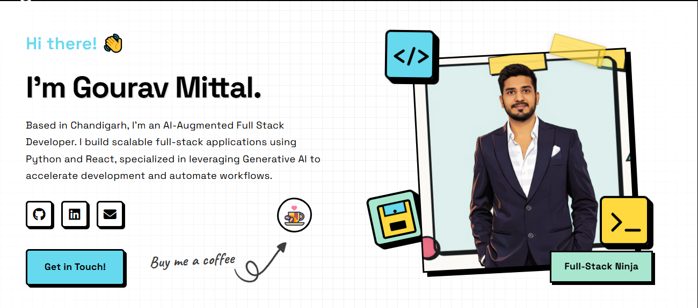
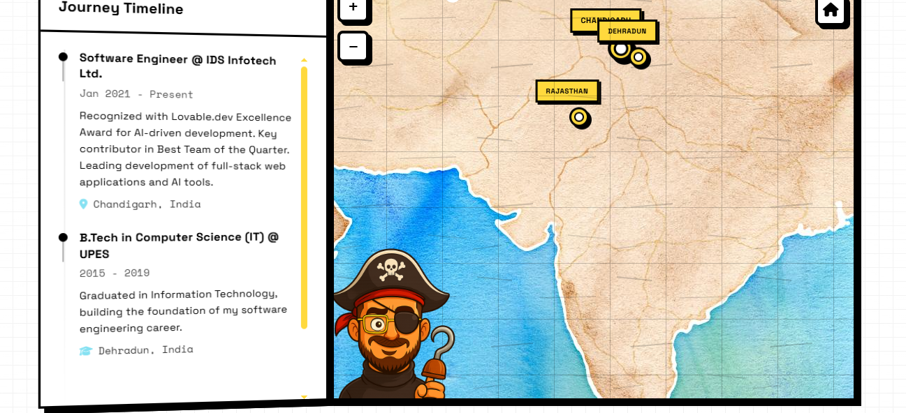
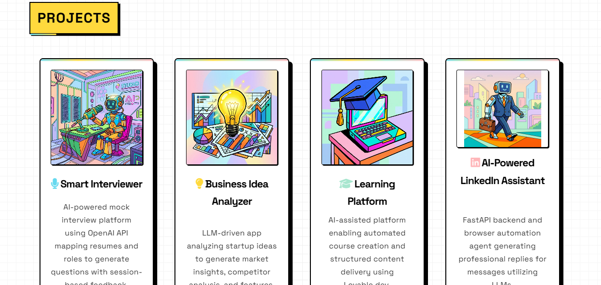

# 🚀 AI Portfolio — Interactive Developer Experience

[](https://gouravmit.github.io/ai-portfolio-interactive/)


An interactive, neo-brutalist portfolio showcasing **AI-powered products**, **system design thinking**, and **modern frontend engineering**.

---

## 🎯 What This Project Demonstrates

* 🧠 AI-first development mindset
* 🌍 Interactive UI with real-time user engagement
* ⚡ Strong frontend engineering (animations, UX, performance)
* 🏗️ Product-level thinking — not just a static portfolio

This is not just a portfolio — it's a **product experience**.

---

## 📸 Preview

### 🏠 Home Experience


### 🗺️ Interactive Journey Map



### 💼 AI Projects Showcase



---

## 🚀 Live Demo

👉 https://gouravmit.github.io/ai-portfolio-interactive/
👉 https://gouravmit.github.io/ai-portfolio-interactive/terminal.html

---

## ⚡ Key Features

* 🌍 Interactive map-based career journey (Leaflet.js)
* 🤖 AI-focused project showcase
* 🎯 Scroll-driven animations & highlight effects
* 🖥️ Terminal-style resume with command interface
* 🎮 Built-in interactive elements (Snake game, typing effects)
* 💎 Premium UI with neo-brutalist design system

---

## 🧠 Tech Stack

* **Frontend:** HTML, CSS, JavaScript
* **UI/UX:** Neo-brutalist design, animations
* **Map Engine:** Leaflet.js
* **Interactive Elements:** p5.js
* **Fonts & Icons:** Google Fonts, Font Awesome

---

## 🎨 Design Philosophy

This project follows a **neo-brutalist design approach**:

* Bold, high-contrast UI
* Visible structure and layout
* Playful, interactive elements
* Hand-crafted experience over templates

It prioritizes **creativity, interaction, and personality** over conventional UI patterns.

---

## 💡 Why This Portfolio Stands Out

Most portfolios are static.

This one is:

* Interactive
* Product-driven
* Experience-focused
* Built with real engineering effort

It reflects how I build **real-world AI systems**, not just UI pages.

---

## 🛠️ Run Locally

```bash
python -m http.server 8000
```

Then open:

```
http://localhost:8000
```

---

## 🙌 Credits

Inspired by open-source portfolio designs and customized extensively into a unique interactive experience.

---

## 👨‍💻 Author

**Gourav Mittal**
AI-Augmented Full Stack Engineer
GenAI | Python | React
